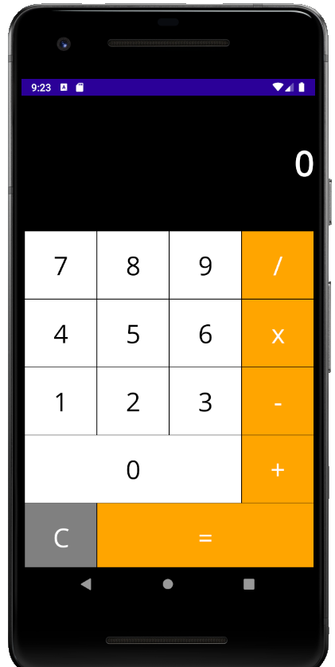

# .NET Multi-platform App UI (.NET MAUI) MauiBasicCalculator 
## Workspace Requirements 
- https://docs.microsoft.com/en-us/dotnet/maui/get-started/installation

This is a very basic port of the Xamarin Sample located at https://github.com/xamarin/mobile-samples/tree/main/LivePlayer/BasicCalculator

Updated MauiBasicCalculator project to the latest version of Maui (Preview 11). The layout anomalies seemed to have been corrected as the code has not changed.

**NOTE: I used a preview version of Visual Studio 2022 ( https://visualstudio.microsoft.com/vs/preview/ ) when developing this and tested it on an Android emulator 

